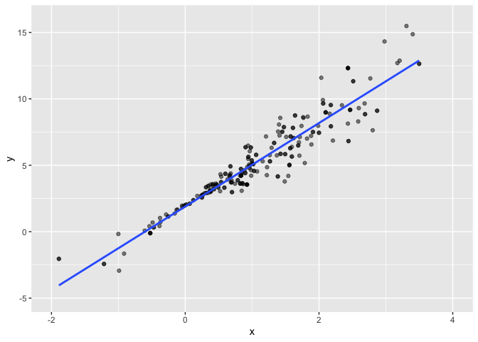
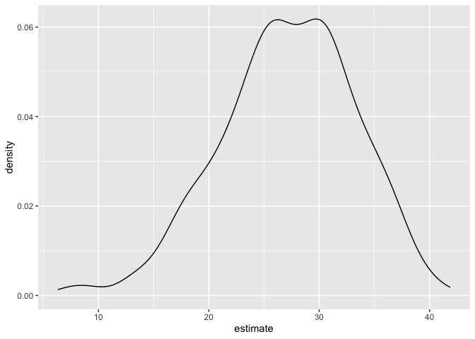

Bootstrapping
================
2025-11-13

``` r
library(tidyverse)
```

    ## ── Attaching core tidyverse packages ──────────────────────── tidyverse 2.0.0 ──
    ## ✔ dplyr     1.1.4     ✔ readr     2.1.5
    ## ✔ forcats   1.0.0     ✔ stringr   1.5.1
    ## ✔ ggplot2   3.5.2     ✔ tibble    3.3.0
    ## ✔ lubridate 1.9.4     ✔ tidyr     1.3.1
    ## ✔ purrr     1.1.0     
    ## ── Conflicts ────────────────────────────────────────── tidyverse_conflicts() ──
    ## ✖ dplyr::filter() masks stats::filter()
    ## ✖ dplyr::lag()    masks stats::lag()
    ## ℹ Use the conflicted package (<http://conflicted.r-lib.org/>) to force all conflicts to become errors

``` r
library(p8105.datasets)
library(modelr)
```

Simulate two datasets.

``` r
set.seed(1) #for reproducibility

n_samp = 250

sim_df_const =
  tibble(
    x = rnorm(n_samp, 1, 1),
    error = rnorm(n_samp, 0, 1),
    y = 2 + 3 * x + error
  )

sim_df_nonconst =
  sim_df_const |> 
  mutate(
    error = 0.75 * error * x, #NON constant error! Violates regression assumption
    y = 2 + 3 * x + error)
```

Look at the data

``` r
sim_df_const |> 
  ggplot(aes(x = x, y = y)) +
  geom_point()
```

<!-- -->

``` r
sim_df_nonconst |> 
  ggplot(aes(x = x, y = y)) +
  geom_point()
```

<!-- -->

What does `lm` do for these?

``` r
sim_df_const |> 
  lm(y ~ x, data = _) |> 
  broom::tidy() |> 
  knitr::kable(digits = 3)
```

| term        | estimate | std.error | statistic | p.value |
|:------------|---------:|----------:|----------:|--------:|
| (Intercept) |    1.977 |     0.098 |    20.157 |       0 |
| x           |    3.045 |     0.070 |    43.537 |       0 |

``` r
sim_df_nonconst |> 
  lm(y ~ x, data = _) |> 
  broom::tidy() |> 
  knitr::kable(digits = 3)
```

| term        | estimate | std.error | statistic | p.value |
|:------------|---------:|----------:|----------:|--------:|
| (Intercept) |    1.934 |     0.105 |    18.456 |       0 |
| x           |    3.112 |     0.075 |    41.661 |       0 |

Write a function to draw a bootstrap sample.

``` r
boot_sample = function(df){
  
  sample_frac(df, size = 1, replace = TRUE) 
  
}

#THIS IS HOW WE BOOTSTRAP! REPLACE=TRUE GIVES A DIFFERENT SAMPLE EVERY TIME WE DO IT. size = 1 gives us a proportional sample (the same size as out original sample). This is where we are actually doing 'repeated sampling' from our dataset.
```

Does this work?

``` r
sim_df_nonconst |> 
  boot_sample() |> 
  ggplot(aes(x = x, y = y)) +
  geom_point(alpha = 0.5) + 
  geom_smooth(method = "lm", se = FALSE) +
  xlim(c(-2, 4)) +
  ylim(c(-5, 16))
```

    ## `geom_smooth()` using formula = 'y ~ x'

<!-- -->

So I want to formalize this a bit and extract results.

``` r
boot_straps =
  tibble(
    iter = 1:5000
  ) |> 
  mutate(
    bootstrap_sample = map(iter, \(i) boot_sample(df = sim_df_nonconst))
  )
```

(quick check)

``` r
boot_straps |> 
  pull(bootstrap_sample) |> 
  nth(1) |> 
  ggplot(aes(x = x, y = y)) +
  geom_point(alpha = 0.5) + 
  geom_smooth(method = "lm", se = FALSE) +
  xlim(c(-2, 4)) +
  ylim(c(-5, 16))
```

    ## `geom_smooth()` using formula = 'y ~ x'

<!-- -->

Actually run my analyses!

``` r
bootstrap_results =
  boot_straps |> 
  mutate(
    fits = map(bootstrap_sample, \(df) lm(y ~ x, data = df)),
    results = map(fits, broom::tidy)
  )
```

Look at results

``` r
bootstrap_results |> 
  select(iter, results) |> 
  unnest(results) |> 
  group_by(term) |> 
  summarize(
    mean = mean(estimate),
    se = sd(estimate)
  )
```

    ## # A tibble: 2 × 3
    ##   term         mean     se
    ##   <chr>       <dbl>  <dbl>
    ## 1 (Intercept)  1.93 0.0762
    ## 2 x            3.11 0.103

``` r
#Compared to sim_df_nonconst broom::tidy - now we have way more confidence, narrower sd for intercept, wider sd for slope
```

Look at these first

``` r
bootstrap_results |> 
  select(iter, results) |> 
  unnest(results) |> 
  filter(term == "x") |> 
  ggplot(aes(x = estimate)) +
  geom_density()
```

<!-- -->

``` r
bootstrap_results |> 
  select(iter, results) |> 
  unnest(results) |> 
  group_by(term) |> 
  summarize(
    ci_lower = quantile(estimate, 0.025),
    ci_upper = quantile(estimate, 0.975),
  )
```

    ## # A tibble: 2 × 3
    ##   term        ci_lower ci_upper
    ##   <chr>          <dbl>    <dbl>
    ## 1 (Intercept)     1.78     2.09
    ## 2 x               2.91     3.32

## Do it again but faster this time

``` r
bootstrap_results =
  sim_df_nonconst |> 
  bootstrap(n = 10) |> 
  mutate(
    df = map(strap, as_tibble),
    fits = map(df, \(df) lm(y ~ x, data = df)),
    results = map(fits, broom::tidy)
  ) |> 
  select(.id, results) |> 
  unnest(results)
```

Look at what this means

``` r
bootstrap_results |> 
  group_by(term) |> 
  summarize(
    mean = mean(estimate),
    se = sd(estimate)
  )
```

    ## # A tibble: 2 × 3
    ##   term         mean     se
    ##   <chr>       <dbl>  <dbl>
    ## 1 (Intercept)  1.91 0.0662
    ## 2 x            3.10 0.0912

``` r
#Same results as before, but more efficient
```

## Airbnb dataset

Remember this one?

``` r
data("nyc_airbnb")

nyc_airbnb =
  nyc_airbnb |> 
  mutate(stars = review_scores_location / 2) |> 
  rename(
    borough = neighbourhood_group
  ) |> 
  filter(
    borough != "Staten Island"
  ) |> 
  drop_na(price, stars, room_type) |> 
  select(price, stars, room_type, borough)
```

Remind me what this looks like?

``` r
nyc_airbnb |> 
  ggplot(aes(x = stars, y = price, color = room_type)) +
  geom_point(alpha = 0.5)
```

<!-- -->

Super skewed, probably shouldn’t trust results of the linear model.

Must bootstrap!

``` r
airbnb_bootstrap_results =
  nyc_airbnb |> 
  filter(borough == "Manhattan") |> 
  bootstrap(n = 1000) |> 
  mutate(
    df = map(strap, as_tibble),
    fits = map(df, \(df) lm(price ~ stars + room_type, data = df)),
    results = map(fits, broom::tidy)
  ) |> 
  select(.id, results) |> 
  unnest(results)
```

Look at the distribution of the slope for stars

``` r
airbnb_bootstrap_results |> 
  filter(term == "stars") |> 
  ggplot(aes(x = estimate)) +
  geom_density()
```

<!-- -->
