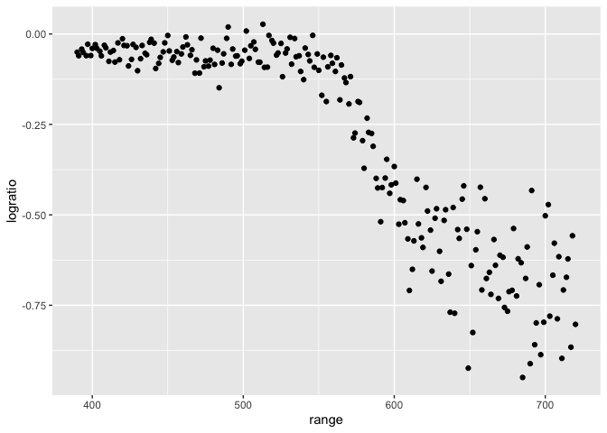
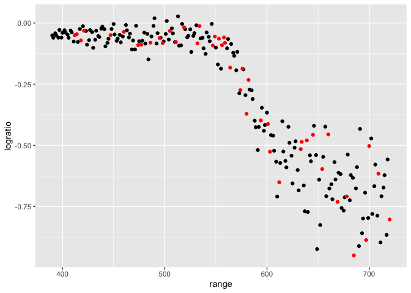
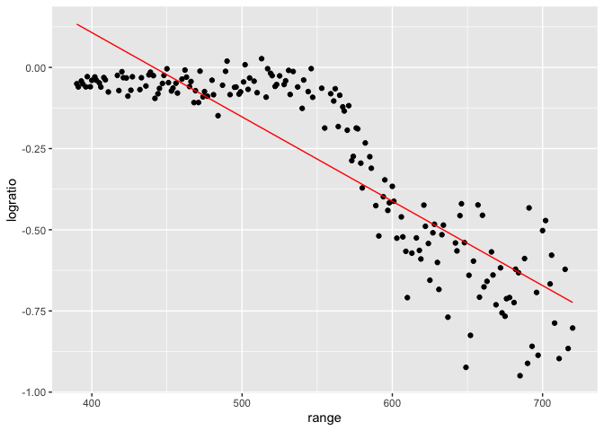
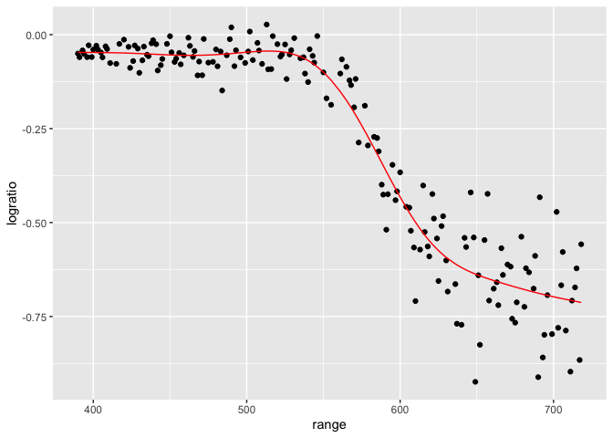
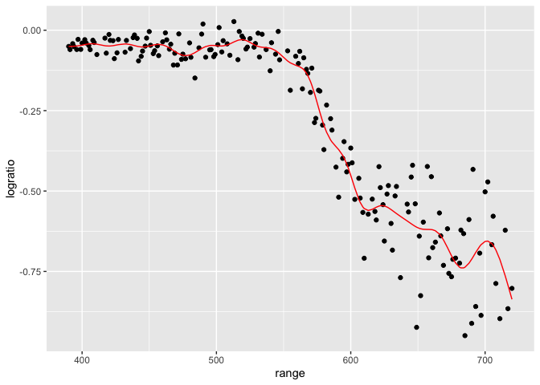

Cross Validation
================
2025-11-11

``` r
library(tidyverse)
```

    ## ── Attaching core tidyverse packages ──────────────────────── tidyverse 2.0.0 ──
    ## ✔ dplyr     1.1.4     ✔ readr     2.1.5
    ## ✔ forcats   1.0.0     ✔ stringr   1.5.1
    ## ✔ ggplot2   3.5.2     ✔ tibble    3.3.0
    ## ✔ lubridate 1.9.4     ✔ tidyr     1.3.1
    ## ✔ purrr     1.1.0     
    ## ── Conflicts ────────────────────────────────────────── tidyverse_conflicts() ──
    ## ✖ dplyr::filter() masks stats::filter()
    ## ✖ dplyr::lag()    masks stats::lag()
    ## ℹ Use the conflicted package (<http://conflicted.r-lib.org/>) to force all conflicts to become errors

``` r
library(modelr)
library(mgcv)
```

    ## Loading required package: nlme
    ## 
    ## Attaching package: 'nlme'
    ## 
    ## The following object is masked from 'package:dplyr':
    ## 
    ##     collapse
    ## 
    ## This is mgcv 1.9-3. For overview type 'help("mgcv-package")'.

``` r
library(p8105.datasets)
```

Load the LIDAR

``` r
data("lidar")

lidar_df =
  lidar |> 
  mutate(id = row_number())

lidar_df |> 
  ggplot(aes(x = range, y = logratio)) +
  geom_point()
```

<!-- -->

## Create dataframes

``` r
#training dataset
train_df = sample_frac(lidar_df, size = 0.8) |> 
  arrange(id)

#testing dataframe (antijoin: gives you everything in the larger dataset that's NOT in the smaller one)
test_df = anti_join(lidar_df, train_df, by = "id")
```

Look at these

``` r
ggplot(train_df, aes(x = range, y = logratio)) +
  geom_point() +
  geom_point(data = test_df, color = "red")
```

<!-- -->

Fit a few models to the `train_df`

``` r
linear_mod = lm(logratio ~ range, data = train_df)
smooth_mod = mgcv::gam(logratio ~ s(range), data = train_df) 
#nonlinear model fitting mgcv:gam, and then s() gives us something smooth

wiggly_mod = mgcv::gam(logratio ~ s(range, k = 30), sp = 10e-6, data = train_df)
#don't do this
```

Look at this (linear)

``` r
train_df |> 
  add_predictions(linear_mod) |> 
  ggplot(aes(x = range, y = logratio)) +
  geom_point() +
  geom_line(aes(y = pred), color = "red")
```

<!-- -->

Look at the smooth one:

``` r
train_df |> 
  add_predictions(smooth_mod) |> 
  ggplot(aes(x = range, y = logratio)) +
  geom_point() +
  geom_line(aes(y = pred), color = "red")
```

<!-- -->

Wiggly (again…don’t do this. OVERFITTED)

``` r
train_df |> 
  add_predictions(wiggly_mod) |> 
  ggplot(aes(x = range, y = logratio)) +
  geom_point() +
  geom_line(aes(y = pred), color = "red")
```

<!-- -->

Try computing our RMSEs (root mean square error)

``` r
rmse(linear_mod, test_df)
```

    ## [1] 0.1260416

``` r
rmse(smooth_mod, test_df)
```

    ## [1] 0.07141255

``` r
rmse(wiggly_mod, test_df)
```

    ## [1] 0.08275634

``` r
#smaller rmse usually means better fit
```
