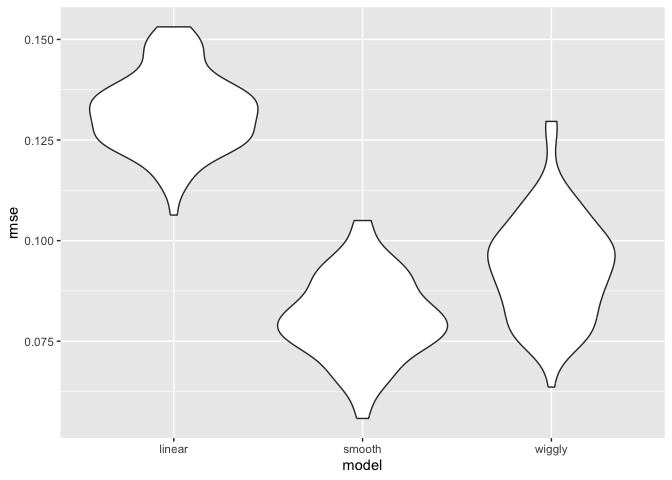

Cross Validation
================
2025-11-11

``` r
library(tidyverse)
```

    ## ── Attaching core tidyverse packages ──────────────────────── tidyverse 2.0.0 ──
    ## ✔ dplyr     1.1.4     ✔ readr     2.1.5
    ## ✔ forcats   1.0.0     ✔ stringr   1.5.1
    ## ✔ ggplot2   3.5.2     ✔ tibble    3.3.0
    ## ✔ lubridate 1.9.4     ✔ tidyr     1.3.1
    ## ✔ purrr     1.1.0     
    ## ── Conflicts ────────────────────────────────────────── tidyverse_conflicts() ──
    ## ✖ dplyr::filter() masks stats::filter()
    ## ✖ dplyr::lag()    masks stats::lag()
    ## ℹ Use the conflicted package (<http://conflicted.r-lib.org/>) to force all conflicts to become errors

``` r
library(modelr)
library(mgcv)
```

    ## Loading required package: nlme
    ## 
    ## Attaching package: 'nlme'
    ## 
    ## The following object is masked from 'package:dplyr':
    ## 
    ##     collapse
    ## 
    ## This is mgcv 1.9-3. For overview type 'help("mgcv-package")'.

``` r
library(p8105.datasets)
```

Load the LIDAR

``` r
data("lidar")

lidar_df =
  lidar |> 
  mutate(id = row_number())

lidar_df |> 
  ggplot(aes(x = range, y = logratio)) +
  geom_point()
```

<!-- -->

## Create dataframes

``` r
#training dataset
train_df = sample_frac(lidar_df, size = 0.8) |> 
  arrange(id)

#testing dataframe (antijoin: gives you everything in the larger dataset that's NOT in the smaller one)
test_df = anti_join(lidar_df, train_df, by = "id")
```

Look at these

``` r
ggplot(train_df, aes(x = range, y = logratio)) +
  geom_point() +
  geom_point(data = test_df, color = "red")
```

<!-- -->

Fit a few models to the `train_df`

``` r
linear_mod = lm(logratio ~ range, data = train_df)
smooth_mod = mgcv::gam(logratio ~ s(range), data = train_df) 
#nonlinear model fitting mgcv:gam, and then s() gives us something smooth

wiggly_mod = mgcv::gam(logratio ~ s(range, k = 30), sp = 10e-6, data = train_df)
#don't do this
```

Look at this (linear)

``` r
train_df |> 
  add_predictions(linear_mod) |> 
  ggplot(aes(x = range, y = logratio)) +
  geom_point() +
  geom_line(aes(y = pred), color = "red")
```

<!-- -->

Look at the smooth one:

``` r
train_df |> 
  add_predictions(smooth_mod) |> 
  ggplot(aes(x = range, y = logratio)) +
  geom_point() +
  geom_line(aes(y = pred), color = "red")
```

<!-- -->

Wiggly (again…don’t do this. OVERFITTED)

``` r
train_df |> 
  add_predictions(wiggly_mod) |> 
  ggplot(aes(x = range, y = logratio)) +
  geom_point() +
  geom_line(aes(y = pred), color = "red")
```

<!-- -->

Try computing our RMSEs (root mean square error)

``` r
rmse(linear_mod, test_df)
```

    ## [1] 0.1406357

``` r
rmse(smooth_mod, test_df)
```

    ## [1] 0.08898497

``` r
rmse(wiggly_mod, test_df)
```

    ## [1] 0.09315303

``` r
#smaller rmse usually means better fit
```

## Iterate!

``` r
cv_df =
  crossv_mc(lidar_df, n = 100) |> 
  mutate(
    train = map(train, as_tibble),
    test = map(test, as_tibble)
  )
```

Did this work? Yes!

``` r
cv_df |> pull(train) |> nth(8) #gives e.g. 8th training and testing split
```

    ## # A tibble: 176 × 3
    ##    range logratio    id
    ##    <dbl>    <dbl> <int>
    ##  1   391  -0.0601     2
    ##  2   393  -0.0419     3
    ##  3   394  -0.0510     4
    ##  4   396  -0.0599     5
    ##  5   397  -0.0284     6
    ##  6   399  -0.0596     7
    ##  7   400  -0.0399     8
    ##  8   403  -0.0395    10
    ##  9   406  -0.0604    12
    ## 10   408  -0.0312    13
    ## # ℹ 166 more rows

Let’s fit models over and over

``` r
cv_df =
cv_df |> 
  mutate(
    linear_fits = map(train, \(df) lm(logratio ~ range, data = df)), #using anonymous function
    smooth_fits = map(train, \(df) mgcv::gam(logratio ~ s(range), data = df)),
    wiggly_fits = map(train, \(df) mgcv::gam(logratio ~ s(range, k = 50), sp = 10e-8, data = df)),
  ) |> 
  #Equivalently, can create a function, and then use it. But we just have 1 input, so let's use an anonymous function
  mutate(
    rmse_linear = map2_dbl(linear_fits, test, rmse), #map2 allows 2 input lists (applies a function to 2 inputs) and the dbl shows us the value (uncollapses)
    rmse_smooth = map2_dbl(smooth_fits, test, rmse),
    rmse_wiggly = map2_dbl(wiggly_fits, test, rmse)
  )
```

Let’s try to look at this better

``` r
cv_df |> 
  select(starts_with("rmse")) |> 
  pivot_longer(
    everything(),
    names_to = "model",
    values_to = "rmse",
    names_prefix = "rmse_"
  ) |> 
  ggplot(aes(x = model, y = rmse)) + 
  geom_violin()
```

<!-- -->
